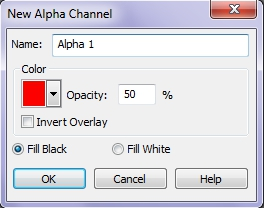
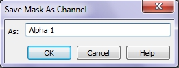

# Сохранение масок в Corel PHOTO-PAINT

Представьте, что вы потратили 10 минут на создание сложной выделенной области, но по какой-то причине случайно закрыли Photo-Paint или выключили компьютер. Вам вряд ли придется по вкусу идея начинать создание выделенной области с самого начала.  
Для того чтобы избежать этого, достаточно воспользоваться командами из подменю **Save** (Сохранить) меню **Mask** (Маска) для сохранения выделенной области как альфа-канала, который отображается в докере **Channels** (Каналы) или для сохранения на жесткий диск в виде файла.

В Photo-Paint, в окне изображения одновременно может быть отображено только одно выделение. Иногда нужно создать несколько выделений и поочередно пользоваться ими для применения изменений к различным фрагментам изображения.

Сохранив выделение в канале, его можно загружать и повторно применять к тому же изображению. Это дает возможность менять выделения для применения с одним изображением, не создавая выделение каждый раз заново. При создании канала выделения первоначальное выделение, использованное для его создания, остается на экране и становится доступным в докере **Channels** (Каналы) в качестве текущего выделения. Канал выделения не изменяется при изменении выделения. Если нужно применить изменения к выделению, то их нужно сохранить в качестве второго канала выделения.

Докер **Channels** (Каналы) предоставляет также и команды для сохранения каналов выделения на диск, а также для открытия ранее сохраненных каналов выделения. Данные команды служат той же цели, что и команды **Save Mask To Disk** (Сохранить на диск) и **Load From Disk** (Загрузить с диска) из меню **Mask** (Маска), чтобы сохранить информацию о выделении на диск, и использовать его позже с любым изображением.

При сохранении изображения в формате Corel PHOTO-PAINT (**.CPT**) канал выделения (альфа-канал) сохраняется вместе с изображением. Если изображение сохраняется в другом формате, канал выделения будет потерян при закрытии изображения. Если нужно сохранить изображение в формате, не поддерживающем информацию о каналах выделения, то сохраните выделение в канале выделения, а затем сохраните канал выделения на диск.

Для выбора канала выделения, который нужно отобразить в окне изображения, используется докер **Channels** (Каналы). В окне изображения одновременно можно показать только один канал выделения. При создании канала выделения он является единственным отображаемым и изменяемым каналом в окне изображения, который отображается в виде черно-белого изображения. Этот режим называется режимом **Paint On Mask** (Рисовать по маске). Если канал выделения отображается вместе с объединенным каналом или любым другим цветовым каналом, он отображается как подкрашивание невыделенного красного цвета с разной степенью прозрачности, в зависимости от характеристик выделения. Одновременно можно отобразить изображение с выделением и канал выделения (альфа-каналом).

При помощи параметра **Color** (Цвет) диалогового окна **Channel Properties** (Свойства канала) можно поменять оттенок канала выделения с красного на любой другой цвет.

### Создание канала выделения

Если выделение потребуется при дальнейшей работе, то перед тем, как удалить выделение из окна изображения, создайте канал выделения (альфа-канал). Канал выделения сохраняется вместе с изображением, если при этом используется формат файла, поддерживающий информацию о выделениях, например, формат **.cpt** Corel Photo-Paint.

**Для создания канала выделения с помощью докера Channels (Каналы):**

1\. Создайте маску при помощи одного из инструментов группы **Mask Tools** (Инструменты маски) на панели Toolbox (Набор инструментов).  
2\. Откройте докер **Channels** (Каналы). Если докер отсутствует на экране, нажмите **Ctrl + F9**, что-бы его открыть.  
В списке каналов будет видна созданная вами на шаге 1 маска – **Current Mask** (Текущая маска).  
3\. Нажмите кнопку **New Alpha Channel** (Создать альфа-канал), находящуюся внизу докера.  
4\. В появившемся диалоговом окне **New Alpha Channel** (Создать альфа-канал) (рис. 1), в поле **Name** (Имя), введите название канала или оставьте предложенный по умолчанию вариант без изменения. Нажмите **ОК**.  
Новый канал появится в списке каналов.  
5\. Внизу докера станет активной кнопка **Save to Current Channel** (Сохранить в текущий канал). Нажмите эту кнопку, чтобы добавить маску в новый канал и сделать его каналом выделения.

Вы также можете сохранить текущую маску, как канал, с помощью команды **Mask > Save > Save as Channel** (Маска > Сохранить > Сохранить как канал). В появившемся диалоговом окне **Save Mask As Channel** (Сохранение маски как канала) (рис. 2), в поле **As** (Как), введите имя канала или оставив его без изменения, щелкните **ОК**.

Если вы уже создали маску, а затем в докере **Channels** (Каналы) создадите новый альфа-канал, то вы можете добавить маску в канал с помощью команды **Mask > Save > Alpha Channel Save** (Маска > Сохранить > Сохранение альфа каналов). Эта команда является аналогом кнопки **Save to Current Channel** (Сохранить в текущий канал) докера **Channels** (Каналы).

Следует отметить одну особенность, что команда **Mask > Save > Alpha Channel Save** (Маска > Сохранить > Сохранение альфа каналов) активна в меню **Mask** (Маска) даже тогда, когда альфа-канал еще не создан, но при выполнении этой команды, никаких изменений не произойдет. Другими словами, вы не внесете никаких изменений в документ, т. к. без наличия альфа-канала эта команда, по существу, не выполнима.

### Сохранение маски на диск

Как уже говорилось выше, для повторного использования масок, их можно сохранять на диск в виде файла. Для этого служит команда **Mask > Save > Save Mask To Disk** (Маска > Сохранить > Сохранить на диск). Сохранение маски в виде файла, ничем не отличается от сохранения обычного файла. В диалоговом окне **Save a Mask to Disk** (Сохранение маски на диск), присвойте имя создаваемому файлу и нажмите **Save** (Сохранить).  
Кроме сохранения непосредственно самой маски, вы также можете сохранять на диск в виде фалов и альфа-каналы.

**Для сохранения канала выделения на диск:**

1\. Выполните команду **Window > Dockers > Channels** (Окно > Окна настройки > Каналы) или нажмите **Ctrl + F9**, чтобы открыть докер **Channels** (Каналы).  
2\. Выберите альфа-канал, щелкнув мышью на миниатюре в списке каналов.  
3\. В меню докера **Channels** (Каналы) выберите команду **Save As** (Сохранить как).  
4\. В поле **Тип файла** укажите тип файла.  
5\. Щелкните на значке диска, на который нужно сохранить альфа-канал.  
6\. Дважды щелкните кнопкой мыши на значке папки, в которую нужно сохранить канал выделения.  
7\. Введите имя файла в поле **Имя файла**.  
8\. Нажмите кнопку **Save** (Сохранить).