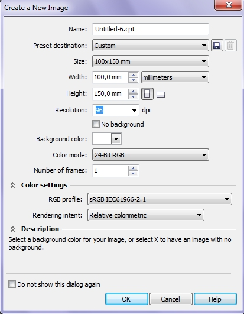

# Создание документа в Photo-Paint Х5

Создать новый пустой документ в Photo-Paint можно двумя основными способами: прямо при запуске программы, в **_Окне приветствия_** выбрать пункт **New blank document** (Новый пустой документ) или во время сеанса работы выполнить команду **File > New** (Файл > Создать), или что тоже самое – нажать кнопку **New** (Создать) на Стандартной панели инструментов. Если вам больше по душе пользоваться сочетаниями клавиш, то нажмите **Ctrl + N**.

Какой бы из перечисленных способов вы не выбрали, результат будет один – откроется диалоговое окно **Create a New Image** (Создание изображения).

Если вы не знакомы с Photo-Paint или работали с предыдущими версиями, то внешний вид этого окна может заставить вас призадуматься. Это окно претерпело значительные изменения, что в первую очередь связано с изменениями, которые претерпела _Система управления цветом_ (**Color Management**) в CorelDRAW Graphics Suite Х5\. Одним из новшеств _Системы управления цветом_, является возможность задавать используемый цветовой профиль каждому документу, что раньше не представлялось возможным. В предыдущих версиях, выбранный цветовой профиль применялся ко всему приложению и автоматически ко всем создаваемым документам. Теперь вы можете выбирать для каждого документа (открытого или создаваемого) свой цветовой профиль, отличный от выбранного цветового профиля по умолчанию.

Диалоговое окно **Create a New Image** (Создание изображения) условно разделено на три части или области. Основную часть окна занимают элементы настройки основных параметров нового изображения, ниже расположена область **Color Settings** (Параметры цвета) и **Description** (Описание).

Рассмотрим теперь все элементы этого диалогового окна более подробно.

*   Поле **Name** (Имя). Служит для ввода (присвоения) имени создаваемого документа.
*   Раскрывающийся список **Preset destination** (Назначение заготовки). В этом списке вы можете задать, прямо на этапе создания документа, его назначение. Этот список позволяет вам выбрать заранее подобранные параметры документа для различного вида работ. Например, если вы решили создать изображение для **Web**, выберите в этом списке пункт **Web** (Веб). Это приведет к автоматической настройке всех остальных параметров создаваемого документа: разрешения, цветового режима, фона, цветового профиля и т. д. Если ни один из предложенных вам вариантов не подходит, можете оставить в этом списке все без изменения, т. е. вариант **Custom** (Настройка). Если вы в своей работе часто используете определенные настройки при создании документа, вы можете сохранить их в виде заготовки. Для этого нажмите кнопку **Add destination** (Добавить назначение) справа от раскрывающегося списка (кнопка в виде дискеты). В появившемся диалоговом окне **Add destination** (Добавить назначение) введите имя заготовки и нажмите **ОК**. Теперь ваши настройки для создаваемых документов сохранены в виде заготовки и будут доступны в списке **Preset destination** (Назначение заготовки). Если созданная вами заготовка вам больше не нужна, вы можете ее удалить, выбрав ее в списке и нажав кнопку (кнопка в виде корзины) **Remove destination** (Удалить назначение).
*   Раскрывающийся список **Size** (Размер) позволяет вам выбрать один из стандартных (или часто встречающихся) форматов изображения.
*   Группа счетчиков **Width** (Ширина) и **Height** (Высота) позволяют вам задать желаемую ширину и высоту создаваемого изображения. Тут же, в раскрывающемся списке можно указать единицы измерения, которые будут использоваться в создаваемом изображении.
*   Две кнопки **Portrait** (Книжная) и **Landscape** (Альбомная) задают ориентацию бумаги.
*   Раскрывающийся список **Resolution** (Разрешение) позволяет выбрать значение разрешения для создаваемого изображения.
*   Раскрывающийся список **Background color** (Цвет фона), служит для задания цвета фона. Если нужного вам цвета нет в раскрывшейся палитре, вы можете выбрать другой, нажав кнопку **Other** (Другой). Откроется знакомое уже вам диалоговое окно **Select Color** (Выбор цвета). Находящаяся в этом же списке пипетка, позволяет взять пробу цвета, например, из уже открытого изображения.
*   Флажок **No background** (Без фона) позволяет создать изображение без фона. В этом случае пустое созданное изображение будет иметь вид шахматной доски. Именно такой вид, по умолчанию в Photo-Paint имеет изображение без фона.
*   Раскрывающийся список **Color mode** (Цветовой режим) позволяет выбрать для изображения один из доступных цветовых режимов.
*   Счетчик **Number of frames** (Число кадров) становится активным при выборе в списке **Preset destination** (Назначение заготовки) варианта **Photo-Paint по умолчанию**. Этот счетчик задает число кадров для файла, если вы решили создать, например, анимацию для **Web**.
*   Область **Color Settings** (Параметры цвета) включает два раскрывающихся списка **Profile** (Профиль) и **Rendering intent** (Способ цветопередачи). Оба эти списка непосредственно влияют на систему управления цветом. Если вы не знаете, что с этим делать, оставьте предлагаемые Photo-Paint параметры. Если вы привыкли работать с цветовым профилем предоставляемым Photoshop, можете выбрать профиль **Adobe RGB (1998)**. Кроме того, если вы на начальном этапе не знаете (или у вас его просто нет), какой профиль будет использоваться в дальнейшем (например, профиль принтера заказчика и т. п.), используйте профиль **sRGB IEC61966-2.1**, предлагаемый по умолчанию. Если вы случайно выбрали не те настройки при создании файла, вы их сможете поменять с помощью средства управления цветом, **Color Management** в диалоговом окне **Document Color Settings** (Параметры цветов документа) вызываемого командой **Tools > Color Management > Document Settings** (Инструменты > Управление цветом > Параметры документа).
*   Область **Description** (Описание) предназначена для того, чтобы «облегчить вам жизнь» при создании документа. При наведении указателя мыши на тот или иной элемент управления, в области **Description** (Описание) тут же появится краткое описание этого элемента.

Области **Color Settings** (Параметры цвета) и **Description** (Описание) можно скрыть с помощью кнопок в виде двойных стрелок, расположенных в заголовках этих областей. И наконец, если вы не хотите видеть это окно при создании новых документов, установите флажок **Do not show this dialog again** (Больше не показывать это окно). В этом случае все вновь создаваемые документы, будут создаваться с настройками, которые были установлены в этом окне во время последнего сеанса работы. Чтобы это диалоговое окно появлялось вновь при создании новых документов, нужно установить эту опцию в диалоговом окне **Options** (Параметры). Описание настроек параметров Photo-Paint, будет приведено в разделе посвященном настройкам программы.