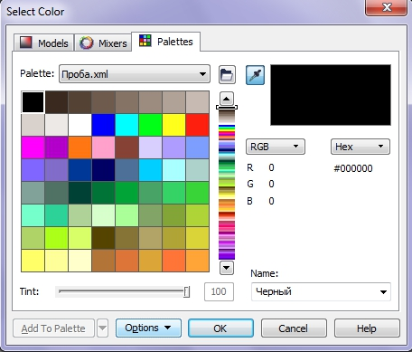
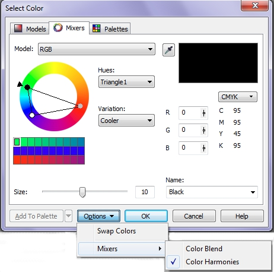
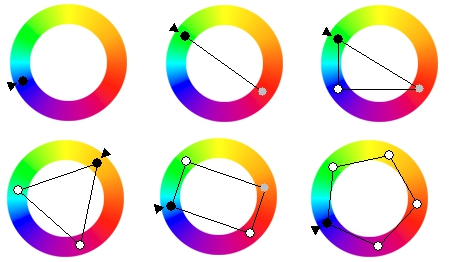
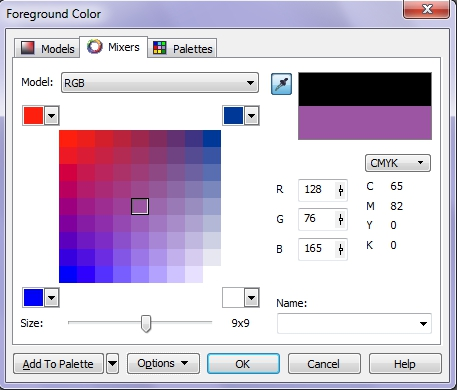
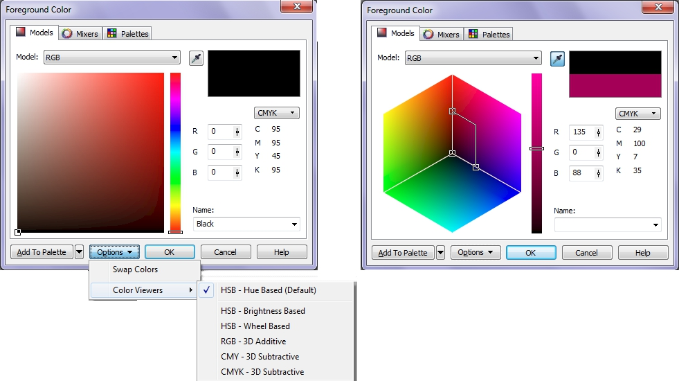

# Создание новых цветов в Corel Photo-Paint

Всякий раз, когда вы хотите выбрать или создать необходимый цвет, отсутствующий в палитре, появляется одно и тоже диалоговое окно, но на разных вкладках. Это окно лишь меняет свое название, в зависимости от того, каким образом вы его вызвали. Например, если вы его вызвали из **_Области управления цветом_**, оно может называться **Foreground Color** или **Background Color**, если вызвали из **Редактора палитр**, оно будет называться **Select Color** (Выбор цвета). C этим окном вам часто придется сталкиваться, если вы будете использовать собственные цвета. Давайте ближе познакомимся с вариантами выбора цвета в этом диалоговом окне.

### Выбор цвета из существующих цветовых палитр

Если вы по какой-либо причине решили выбрать цвет в одной из существующих палитр, вы можете это сделать перейдя на вкладку **Palettes** (Палитры).

Для выбора цвета, вам необходимо сначала выбрать ее из раскрывающегося списка **Palette** (Палитра). В этом списке находятся все доступные палитры. Если необходимая вам палитра отсутствует в этом списке, вы можете открыть ее щелкнув на кнопке в виде папки, рядом со списком. В открывшемся диалоговом окне **Open Palette** (Открыть палитру) выберите нужную вам палитру. Ниже под списком находится область просмотра, в которой показаны все цвета открытой вами палитры. Ползунок справа содержит маленькие образцы всей палитры для ускоренного перемещения по палитре.

В правой части окна находится область просмотра цвета. Она разделена на две части, в верхней показан старый цвет, а в нижней новый, т.е. тот, который вы выбрали. Пока вы не выберите новый цвет, будет отображаться только один цвет, как показано на рисунке. Ниже находится область **Компоненты**, в которой указаны соотношения компонентов цвета. Здесь можно выбрать сразу две цветовых модели, для отображения значений соотношения компонентов цвета в каждой из них. Вы также можете выбрать новый цвет по названию, в раскрывающемся списке **Name** (Имя). Ползунок **Tint** (Оттенок) остается не активен, пока вы не выберите соответствующую палитру, например, из набора палитр **PANTONE**.

Раскрывающийся список **Options** (Параметры) претерпел изменения в Photo-Paint X5, теперь здесь осталось три команды. В этом списке вы можете выбрать режим отображения палитры, либо в виде цветовых ячеек или режим **Show Color Names** (Показать имена цветов). Команда **Swap Colors** (Поменять цвета местами) из этого же списка позволяет поменять местами старый и новый цвет, что будет видно в области просмотра цвета, в верхней правой части окна.

### Вкладка Mixers (Краскосмесители)

На вкладке **Mixers** (Краскосмесители) диалогового окна **Select Color** (Выбор цвета) вы можете работать со смесителями в двух основных режимах, в режиме **Color Blend** (Смеситель) и **Color Harmonies** (Гармония цветов). В зависимости от выбранного вами режима, вид окна на вкладке **Mixers** (Краскосмесители) будет различным. Мы рассмотрим оба эти режима.

_Режим **Color Harmonies** (Гармония цветов)_.

В этом режиме для генерации цветов используется интерфейс цветового круга. Если у вас по какой-то причине вкладка открылась в режиме **Color Blend** (Смеситель), вы можете переключиться на режим **Color Harmonies** (Гармония цветов), выбрав его в списке **Options** (Параметры) (см рис. ниже). Инструмент **Color Harmonies** (Гармония цветов) полезен в случаях, когда вам нужны согласованные наборы цветов. В раскрывающемся списке **Hues** (Оттенки) вы можете выбрать один из шести типов интерактивного инструмента выбора цвета, необходимый вам для работы.

Гармония цветов получается в результате наложения фигуры, например прямоугольника или треугольника, на цветовой круг. Типы интерактивных элементов для синтеза цвета представлены на рисунке.

В Photo-Paint имеется пять видов фигур накладываемых на цветовой круг (в случае выбора режима **Primary** (Основной) накладывается не фигура, а точка).

В зависимости от выбранного вами типа фигуры, будет сформирована таблица цветов, из которой вы можете выбрать нужный вам цвет. Размер таблицы генерируемых цветов задается с помощью ползунка **Size** (Размер).

Чтобы было легче понять принцип работы элементов управления на вкладке **Mixers** (Краскосмесители), выберите разные комбинации параметров. Например, в списке **Hues** (Оттенки) выберите режим **Primary** (Основной), а в списке **Variation** (Вариация) пункт **None** (Нет). В этом случае вы увидите таблицу всего лишь из одной цветовой ячейки, а ползунок **Size** (Размер) становится неактивным. Теперь выберите другие режимы в списке **Hues** (Оттенки) и вы увидите, что Photo-Paint создает таблицу цветов, состоящую из одного столбца, количество ячеек в котором зависит от выбранной фигуры.

Форму фигур, накладываемых на цветовой круг можно изменять с помощью трех типов угловых точек:

*   черной, нажатие которой позволяет перемещать одновременно все точки вдоль цветового круга, не изменяя форму фигуры;
*   серой, жестко связанной с черной точкой и образующей с ней комплементарную цветовую пару;
*   белой (или нескольких белых). Количество точек зависит от формы фигуры. Эти точки можно перемещать, искажая форму фигуры и получая новый набор согласованных цветов.

Рассмотрим подробнее предлагаемые варианты фигур накладываемых на цветовой круг из раскрывающегося списка **Hues** (Оттенки).

1.  **Primary** (Основной) (рис. _а_). Этот вариант позволяет выбрать только один основной цвет.
2.  **Complement** (Дополнительный) (рис. _б_). Комплиментарными, или дополнительными, контрастными, являются цвета, расположенные на противоположных сторонах цветового круга. Выглядит их сочетание очень живо и энергично, особенно при максимальной насыщенности цвета. Использовать комплиментарную гамму для больших композиций трудно, но если надо что-то выделить, подчеркнуть, это то, что вам нужно.
3.  **Triangle 1** (Треугольник 1) (рис. _в_). Контрастная триада – вариант комплиментарного сочетания цветов, только вместо противоположного цвета используются соседние для него цвета. Выглядит эта схема почти настолько же контрастно. Если вы не уверены, что сможете правильно использовать комплиментарные цвета – используйте контрастную триаду.
4.  **Triangle 2** (Треугольник 2) (рис. _г_). Классическую триаду образуют три равноудаленных по цветовому кругу цвета. Такая композиция выглядит достаточно живой даже при использовании бледных и ненасыщенных цветов. Чтобы добиться гармоничности в триаде, возьмите один цвет за главный, а два других используйте для акцентов.
5.  **Rectangle** (Прямоугольник) (рис. _д_). Прямоугольная схема состоит из четырех цветов, каждые два из которых – комплиментарные. Эта схема дает, пожалуй, самое большое количество вариаций входящих в нее цветов. Чтобы проще было сбалансировать прямоугольную схему, один цвет надо выбрать доминирующим, остальные – вспомогательными.
6.  **Pentagon** (Пятиугольник) (рис. _е_). Является «расширенным вариантом» прямоугольной схемы.

Спектр созданных таким образов согласованных цветов может быть расширен с помощью раскрывающегося списка **Variation** (Вариация). Этот список предлагает пять различных вариаций цвета. Количество генерируемых цветов в таблице можно изменять с помощью ползунка **Size** (Размер).

На этой же вкладке в области просмотра образца цвета, отображается старый цвет и выбранный вами в качестве основного новый цвет. Новинкой в Photo-Paint Х5 является возможность выбора цвета из образца с помощью пипетки. Такая пипетка появилась во многих окнах и служит для интерактивного выбора цвета с экрана. Ниже имеется область, в которой указаны числовые значения каждого компонента составляющего цвет (модель **RGB**, а справа от нее значения цветовой модели, которую вы выберите из списка). В этих же полях можно задавать значения для указания нового основного цвета. Раскрывающийся список **Name** (Имя) позволяет выбирать новый цвет по его названию.

_Режим **Color Blend** (Смеситель)_

Переход в этот режим осуществляется аналогично переходу в режим **Color Harmonies** (Гармония цветов), т. е. выбором этого режима в выпадающем меню **Options** (Параметры) на вкладке **Mixers** (Краскосмесители). Этот режим предназначен для создания набора цветов из смеси четырех цветов выбранных вами. Вид вкладки **Mixers** (Краскосмесители) в режиме **Color Blend** (Смеситель) показан на рисунке ниже.  
Квадратная сетка, которая используется для смешивания цветов и может иметь размеры от 3х3 до 32х32\. Изменение размеров сетки производится ползунком **Size** (Размер), что приводит к изменению градаций цвета.  
Смешивание цветов происходит автоматически при очередной установке нового цвета в одном из углов сетки или изменении ее размеров.

### Вкладка Models (Модели)

Вид вкладки Models (Модели) представлен на рисунке ниже.

В раскрывающемся списке **Model** (Модель) выберите цветовую модель. Пункт, который вы выберете в списке, определяет модель данного цвета. Справа расположена область просмотра цвета, которая содержит образцы цвета до и после редактирования, **Old color** (Старый цвет) и **New color** (Новый цвет). В области выбора, цвет выбирается интерактивно в каком-то из режимов просмотра, в полях ввода указаны значения компонентов текущего цвета. Если выбран цвет, не входящий в гамму принтера, Corel PHOTO-PAINT отображает цвет гаммы принтера, наиболее близкий к выбранному цвету. Этот цвет отображается в области просмотра образца цвета в виде небольшого квадратика рядом с новым цветом. Можно выбрать наиболее близкий цвет из гаммы или скорректировать выбранный цвет, не входящий в гамму. Режим просмотра (например, рис. справа) задается в списке **Color Viewers** (Программы просмотра цветов), доступ к которому осуществляется кнопкой **Options** (Параметры). При переходе в другой режим просмотра изменяется только лишь способ интерактивного задания значений компонентов цвета. Кнопка **Add To Palette** (Добавить в палитру) добавляет текущий цвет в одну из активных (т. е. открытых в текущим момент) палитр, по вашему выбору.