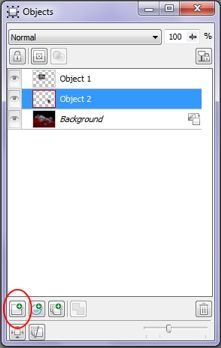

# Создание объектов в Photo-Paint

При редактировании изображений очень удобно использовать многочисленные преимущества создания и работы с объектами, заложенные в программе Photo- Paint.

### Создание объектов из редактируемой области

Содержимое маски легко преобразовать в объект. Это означает, что пиксели внутри рамки выделения становятся объектом и «плавают» поверх изображения. Объект можно создать путем копирования редактируемой области и вырезанием выделенной части. Если объект создается копированием, то при создании объекта из выделения копируются пиксели, ограниченные рамкой выделения. При этом перемещение объекта не влияет на находящееся под ним изображение. Если же создать объект вырезанием редактируемой области и затем его переместить, на месте, где находился объект, появится «дырка», имеющая цвет фона.

При работе с конкретным объектом остальные компоненты изображения – объекты и фон изображения – блокируются. Если создается выделение и оно преобразуется в объект, он включает из редактируемого объекта пиксели, находящиеся только внутри выделения. Если попробовать создать объект из выделенной области созданной за пределами активного в данный момент объекта, выводится сообщение **Selection is empty** (Выделение пусто). Это значит, что выделение не содержит ни одного пикселя редактируемого в данный момент объекта.

**Для создания объекта из выделения выполните следующие действия:**

1\. Откройте группу инструментов **Mask Tools** (Инструменты маски) на панели **Toolbox** (Набор инструментов) и выберите инструмент выделения.

2\. В окне изображения определите область, которую хотите сделать объектом.

По своему усмотрению выполните одну из команд, **Object > Create > Object: Copy Selection** (Объект > Создать > Объект: Копировать выделение) или **Object > Create > Object: Cut Selection** (Объект > Создать > Объект: Вырезать выделение). Новый объект, окруженный выделяющей рамкой и манипуляторами выделения, «плавает» поверх изображения. Рамка выделения исчезает.

Самый быстрый способ создать объект из выделенной области – с помощью клавиатуры. Для создания объекта копированием выделения нажмите **Ctrl + Стрелка вверх**, для вырезания – нажмите **Ctrl + Shift + Стрелка вверх**. Можно также создать объект из выделенной области, если сразу после создания выделенной области, щелкнуть внутри нее правой кнопкой мыши и выбрать в меню **Object: Copy Selection** (Объект: Копировать выделение) или **Object: Cut Selection** (Объект: Вырезать выделение).

Помните, что вырезание приводит к появлению в изображении, в котором производилось выделение, "дырки", имеющей цвет фона.

### Создание объекта с помощью буфера обмена

В меню **Edit** (Правка) команда **Paste As New Object** (Вставить как новый объект) дает возможность скопировать данные из буфера обмена и автоматически сделать их объектом в любом режиме редактирования.

**Для создания объекта с помощью буфера обмена:**

1\. Откройте группу инструментов **Mask Tools** (Инструменты маски) на панели **Toolbox** (Набор инструментов) и выберите инструмент выделения.

2\. В окне изображения определите (выделите) область, которую хотите сделать объектом.

3\. Щелкните Edit > Cut (Правка > Вырезать) или Edit > Copy (Правка > Копировать).  
Пиксели, находящиеся внутри выделяющей рамки, помещаются в буфер обмена. Если создание объекта производится путем вырезания выделения, пиксели удаляются, оставляя в изображении область, имеющую цвет фона. Если выделение копируется, пиксели внутри выделяющей рамки копируются, и исходное изображение не затрагивается.

4\. Щелкните **Edit > Paste > Paste As New Object** (Правка > Вставить > Вставить как новый объект).  
Пиксели вставляются в текущий документ в качестве объекта, который плавает поверх фона изображения. Цвет рамки объекта по умолчанию синий.

### Создание объекта с нуля

Команда **Object > Create > New Object** (Объект > Создать > Новый объект) создает пустой прозрачный слой, покрывающий все изображение. По сути этот спой является невидимым объектом. Для создания видимых элементов в новом объекте в слой можно добавлять элементы. При создании объекта с помощью этих инструкций ни один из используемых инструментов не воздействует на расположенное внизу изображение.

1\. Выполните команду **Object > Create > New Object** (Объект > Создать > Новый объект) или нажмите кнопку **New Object** (Новый объект) в докере **Objects** (Объекты) (рис. 1). Если докера нет на экране, для его вызова выполните команду **Window > Dockers > Objects** (Окно > Окна настройки > Объекты) или нажмите комбинацию клавиш **Ctrl + F7**.

2\. В панели **Toolbox** (Набор инструментов) выберите инструмент. Можно использовать инструменты группы **Shape Tools** (Фигура), **Effect** (Эффект), **Paint** (Кисть), а также инструмент **Image Sprayer** (Распылитель).

3\. С помощью Панели свойств выберите параметры инструмента.

4\. В окне изображения используйте выбранный инструмент для создания объекта.  
Все применяемые к изображению элементы очерчены рамкой объекта. Миниатюра объекта в докере **Objects** (Объекты) обновляется при каждом изменении объекта.

5\. Для добавления к объекту дополнительных элементов повторите операции пунктов 2 - 4, используя другой инструмент.

Рамка объекта расширяется, включая в объект все новые элементы. При использовании инструмента **Eraser** (Ластик) выделяющая рамка уменьшается, поскольку из объекта удаляются пиксели.

Использование инструмента **Text** (Текст) не добавляет текст в новый прозрачный спой. Он создает отдельный текстовый объект.

### Создание объекта из фона

Когда вы откроете какое-либо изображение, посмотрите в докер **Objects** (Объекты). Обратите внимание на то, что Photo-Paint отображает в докере открытое вами изображение, как **Background** (Фон). Теперь вы можете создать из фона объект или наверно правильней будет сказать, фон «превратится» в объект. Если вы перетащите изображение в сторону, вы увидите, что под ним «пустое место». После этого, вы сможет делать с вашим изображением все операции, которые можно выполнять с объектами.

Для создания объекта из фона выполните команду **Object > Create > From Background** (Объект > Создать > Из фона).