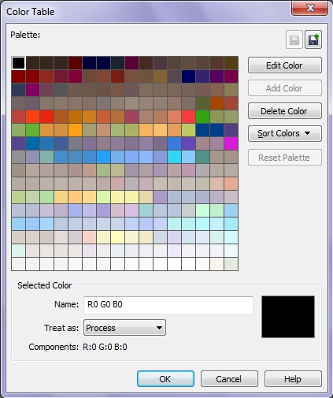

# Создание палитры на основе документа в Corel Photo-Paint

В Photo-Paint имеется возможность создать цветовую палитру непосредственно на основе цветов самого документа. Для этого выполните следующие действия:

1\. Выберите **Window > Color Palettes > Create Palette From Document** (Окно > Цветовые палитры > Создать палитру из документа). Появится диалоговое окно **Color Table** (Таблица цветов), которое аналогично рассмотренному окну **Редактора палитр**. Photo-Paint автоматически генерирует на основе цветов документа цветовую таблицу состоящую из 256 цветов.

2\. Нажмите кнопку **Save Palette As** (Сохранить палитру как), чтобы сохранить палитру.

3\. Отредактируйте цвета по своему усмотрению.

Вы не сможете во время создания палитры добавить в нее новый цвет, т. к. кнопка **Add Color** (Добавить цвет) неактивна. Чтобы это сделать, вам нужно открыть палитру, если вы ее закрыли и затем запустить **Редактор палитр**.

Можно также создать палитру с помощью окна **Image Palette** (Палитра документа), которое является новинкой Photo-Paint Х5\. Цвета в эту палитру добавляются с помощью пипетки или перетаскиванием объекта в окно палитры. Также можно создать палитру, вызвав команду **Add Colors from Image** (Создать палитру из изображения) из меню палитры.