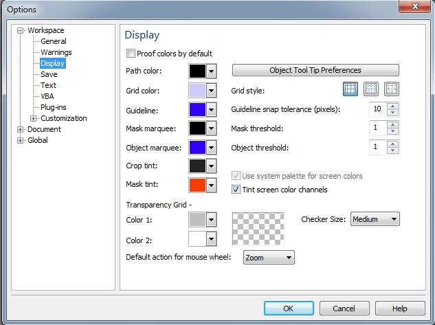

# Страница Display (Монитор)

На этой странице диалогового окна **Options** (Параметры) собраны элементы управления отвечающие в основном за то, как те или иные действия выполняемые в Photo-Paint, будут отображаться на экране. По большей части, эти параметры влияют на удобство при работе, нежели на саму работу приложения. Давайте подробней рассмотрим элементы управления собранные на странице **Display** (Монитор) (рис. 1).

*   Флажок **Proof colors by default** (Цвета пробы по умолчанию) – отвечает за включение и отключение создания программных цветопроб по умолчанию. Этот флажок является новинкой Photo-Paint X5\. Программная цветопроба позволяет предварительно просмотреть документ на экране, чтобы узнать, как он будет выглядеть при печати на конкретном принтере или при воспроизведении на конкретном мониторе.
*   Указатель цвета **Path color** (Цвет пути) – определяет цвет линии, создаваемой инструментом **Path** (Путь).
*   Указатель цвета **Grid color** (Цвет сетки) – определяет цвет линий сетки.
*   Указатель цвета **Guideline** (Направляющие) – определяет цвет направляющих.
*   Указатель цвета **Mask marquee** (Рамка маски) – определяет цвет ограничивающей рамки маски (в виде «марширующих муравьев»).
*   Указатель цвета **Object marquee** (Рамка объекта) – определяет цвет ограничивающей рамки объекта.
*   Указатель цвета **Crop tint** (Оттенок обрезки) – определяет цвет затенения при использовании инструмента **Crop** (Обрезка). Как я уже писал в начале книги, при создании рамки обрезки, обрезаемая часть слегка затемняется. Оттенок этой «затемняемой» части будет зависеть от цвет выбранного в этом _Указателе цвета_.
*   Указатель цвета **Mask tint** (Оттенок маски) – определяет цвет, которым будет «залита» маска в режиме **Mask Overlay** (Наложение маски).
*   Раскрывающийся список **Object Tool Tip Preferences** (Настройка советов для инструмента объекта) – позволяет выбрать, какая информация об объекте будет отображаться в всплывающей подсказке, при наведении указателя мыши на выделенный объект.
*   Набор переключателей **Grid style** (Стиль сетки) – позволяет выбрать один из трех стилей сетки. Как вы помните, включение и выключение отображения сетки задается одноименной командой в меню **Image** (Изображение).
*   Счетчик **Guideline snap tolerance (pixels)** (Допуск привязки направляющей (пикселей) – позволяет регулировать чувствительность команды **Snap To > Guidelines** (Привязывать к > Направляющим). Если привязка к направляющим активирована, то при перемещении объекта в пределах указанного расстояния от направляющей, объект привязывается к ней.
*   Счетчик **Mask threshold** (Порог маски) – позволяет осуществлять точную настройку положения рамок выделения для доступных областей, края которых размыты. Подробно этот параметр был рассмотрен в [Главе VII](../Komanda-Feather-Razmyt-kraya/index.md).
*   Счетчик **Object threshold** (Порог объекта) – позволяет осуществлять точную настройку положения выделений объектов с размытыми краями. Выберите порог в диапазоне от 1 до 255\. При значении порога, равном 255, выделение располагается на самых непрозрачных пикселях размытого края выделения, т.е. на наиболее удаленных от центра объекта. Установка значения 255 приводит к размещению выделения на самых удаленных от центра объекта пикселях, не измененных размытием краев объекта, т. е. являющихся непрозрачными. Установка значения 1, приводит к размещению выделения объекта на самых близких к центру пикселях, измененных размытием.
*   Флажок **Tint screen color channel** (Использовать оттенки для каналов цвета на экране) – позволяет выбрать вариант отображения каналов. При установленном флажке, каждый канал представлен в цвете. При сброшенном флажке, каждый канал отображается в оттенках серого.

**Область Transparency Grid (Таблица прозрачности)**

В этой области находятся два _Указателя цвета_: **Color 1** (Цвет 1) и **Color 2** (Цвет 2). Эта сетка в виде шахматной доски появляется тогда, когда Photo-Paint отображает отсутствие фона. По умолчанию, она выглядит в виде клеточек серого и белого цвета. Вы можете изменить эти цвета, выбрав необходимый в одном из этих _Указателей цвета_. Маленькая область просмотра, расположенная рядом, позволяет увидеть, как будет выглядеть эта «сетка» при изменении цвета.  
Раскрывающийся список **Checker Size** (Размер средства проверки) позволяет выбрать размер клеток фона.  
В самом низу страницы **Display** (Монитор), расположен раскрывающийся список **Default action for mouse wheel** (Операция по умолчанию для колесика мыши), позволяющий выбрать поведение при прокрутке колесика: изменение масштаба или прокрутка изображения.