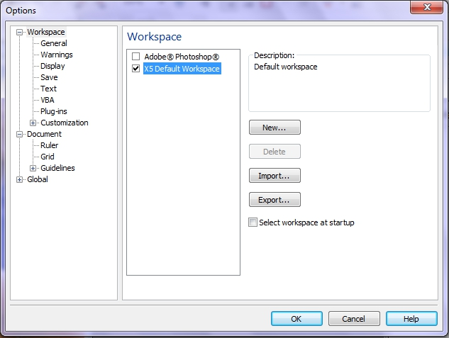
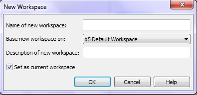
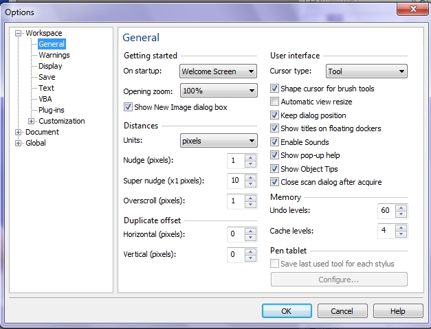
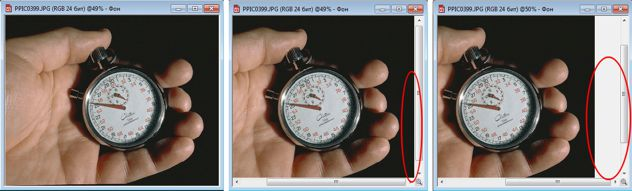

# Страницы Workspace и General

### Страница Workspace (Рабочее пространство)

На странице **Workspace** (Рабочее пространство) вы можете настроить рабочее пространство Photo-Paint в целом. Здесь нет индивидуальных настроек отдельной части приложения. На этой станице, вы можете выбрать _Рабочее пространство_ программы целиком, что означает изменение всех настроек, а именно, состав панелей инструментов, названия команд, состав меню, горячие клавиши и т .д. Страница **Workspace** (Рабочее пространство) диалогового окна **Options** (Параметры) показана на рис. 1.

На этой странице выбор параметров не широк. Здесь расположен список доступных _Рабочих пространств_, в котором вы можете выбрать необходимое для работы. Правее расположена область **Description** (Описание), где содержится краткая информация о выбранном _Рабочем пространстве_. Под областью **Description** (Описание) расположен ряд кнопок, собственно управляющих _Рабочими пространствами_.

Кнопка **New** (Создать). Эта кнопка запускает процедуру создания нового _Рабочего пространства_. По нажатии открывается диалоговое окно **New Workspace** (Новое Рабочее пространство) (рис. 2).

Поле **Name of new workspace** (Имя нового рабочего пространства) служит для задания названия создаваемого _Рабочего пространства_. То название, которое вы введете в это поле, будет отображаться в списке доступных _Рабочих пространств_ на странице **Workspace** (Рабочее пространство).

Раскрывающийся список **Base new workspace on** (Использовать для создания нового рабочего пространства) позволяет выбрать _Рабочее пространство_, на основе которого будет создаваться новое. Это значит, что вы за основу для нового _Рабочего пространства_ выбираете те настройки, которые имеются в указанном _Рабочем пространстве_.

Поле **Description of new workspace** (Описание нового рабочего пространства). Информация введенная вами в этом поле появится в области **Description** (Описание). Сюда следует записать краткую информацию, если вы планируете широко использовать различные Рабочие пространства в своей работе и будете создавать их несколько. Это поле необязательно для заполнения.

Вообще идея иметь отдельное _Рабочее пространство_ для определенного вида работ не лишена смысла. Вы можете настроить _Панели инструментов_, меню и т. д., например, для создания графики для Web. В этом случае вам понадобится под рукой определенный набор инструментов и команд. Вы все это организовываете в виде нового _Рабочего пространства_ и переключаетесь на него при необходимости. И краткое описание не помешает для подсказки при выборе его из списка.

Флажок **Set as current workspace** (Сохранить, как текущее рабочее пространство) позволяет создаваемое _Рабочее пространство_ сразу сделать текущим по умолчанию по окончании процедуры создания. После нажатия кнопки **ОК**, новое _Рабочее пространство_ появится в списке, на странице **Workspace** (Рабочее пространство).

Как только в списке появилось новое пользовательское _Рабочее пространство_, становится доступна кнопка **Delete** (Удалить), назначение которой вполне очевидно. После создания нового _Рабочего пространства_ самое время его сохранить. Для этого предназначена кнопка **Export** (Экспорт). После нажатия этой кнопки Photo-Paint выведет диалоговое окно **Export Workspace** (Экспорт рабочего пространства), в котором можно указать, какие именно элементы вы хотите сохранить. Для сохранения нажмите в диалоговом окне кнопку **Save** (Сохранить). Photo-Paint сохраняет _Рабочее пространство_ в виде файла с расширением **.xlst**.

### Страница General (Общие)

В соответствии со своим названием, на странице **General** (Общие) собраны параметры, отвечающие за общие настройки программы (рис. 3).

Страница **General** (Общие) условно разделена на несколько областей, в которых сгруппированы соответствующие параметры.

**Область Getting started (Начало работы)**

*   Раскрывающийся список **On startup** (При запуске) – позволяет выбрать вариант запуска приложения. Под вариантом запуска подразумевается, что сделает Photo-Paint после загрузки, покажет _Экран приветствия_, создаст новый документ или выполнит действие выбранное из списка.
*   Раскрывающийся список **Opening zoom** (Масштаб при открытии) – позволяет задать, в каком масштабе по умолчанию будет открываться изображение.
*   Флажок **Show New Image dialog box** (Показать диалоговое окно создания изображения) – определяет, будет ли появляться диалоговое окно **Create a New Image** (Создать Изображение) при выполнении команды **File > New** (Файл > Создать).

**Область Distances (Расстояния)**

*   Раскрывающийся список **Units** (Единицы измерения) – служит для выбора единиц измерения в приложении. Вы сможете увидеть изменение единиц измерения, включив например, линейки.
*   Счетчик **Nudge** (pixels) (Перемещение (пикселей)) – определяет, на какое расстояние (в пикселях) будут перемещаться объекты и рамки выделения, при нажатии клавиш управления курсором.
*   Счетчик **Super nudge (x1 pixels)** (Большое перемещение (х1пикселей)) – определяет, на какое расстояние (в пикселях) будут перемещаться объекты и рамки выделения, при удерживании клавиши **Shift** и нажатии клавиш управления курсором. На мой взгляд, более удачным названием этого параметра, было название – _Ускоренное перемещение_, как в ранних версиях.
*   Счетчик **Overscroll** (pixels) (Быстрая прокрутка (пикселей)) – определяет размер дополнительного поля вокруг изображения. Вас может ввести в полное заблуждение русское название этого счетчика. К быстрой или любой другой прокрутке, этот счетчик не имеет ни малейшего отношения. Чтобы вам было понятней о чем идет речь, посмотрите на рис. 4.

На рис. 4 (слева) показано исходное изображение и размер _Окна изображения_ «подогнан» под само изображение. Затем размер _Окна изображения_ был уменьшен, чтобы на нем появились полосы прокрутки, как показано на рис. 4 (по центру). Обратите внимание, что при просмотре края изображения, между самим изображением и _Окном изображения_, остается еле видимое поле (обведено красным овалом). Размер этого поля – и есть параметр **Overscroll** (pixels) (Быстрая прокрутка (пикселей)). И наконец, чтобы увидеть изменение размера этого поля, я изменил значение в счетчике **Overscroll** (pixels) (Быстрая прокрутка (пикселей)) на 50, как показано на рис. 4 (справа). Поле между изображением и _Окном изображения_ стало очень заметным (также обведено красным овалом). По умолчанию, значение **Overscroll** (pixels) (Быстрая прокрутка (пикселей)) = 1.

**Область Duplicate offset (Дублировать смещение)**

Опять же, в который раз, русское название не отражает сути параметров. На самом деле, речь идет не о дублировании некоего смещения, а о смещении дубликата. Нормальное название этой области должно быть – _Смещение при дублировании_. Вот это название, уже отражает назначение параметров. Группа этих параметров задает расстояние, на которое переместится дубликат, т. е. при выполнении команды _Дублировать_, дубликат будет не поверх исходного объекта, а автоматически сместится.

*   Счетчик **Horizontal (pixels)** (По горизонтали (пикселей)) – определяет расстояние в пикселях, на которое сместится дубликат по горизонтали.
*   Счетчик **Vertical (pixels**) (По вертикали (пикселей)) – определяет расстояние в пикселях, на которое сместится дубликат по вертикали.

**Область User Interface (Интерфейс пользователя)**

*   Раскрывающийся список **Cursor type** (Тип курсора) – позволяет выбрать внешний вид курсора для инструментов Photo-Paint. Скорее всего, вас устроит значение по умолчанию.
*   Флажок **Shape cursor for brush tools** (Форма курсора для инструментов кисти) – определяет форму курсора, при выборе в качестве текущего, инструмент Кисть. Если этот флажок сброшен, вид курсора не будет изменяться при выборе различных форм кистей. Другими словами, курсор будет всегда иметь вид маленькой кисточки.
*   Флажок **Automatic view resize** (Автоматически менять размер окна) – определяет, будет ли автоматически изменяться размер Окна изображения, в соответствии с размером самого изображения. Если, например, вы уменьшите масштаб, размер Окна изображения автоматически уменьшится.
*   Флажок **Keep dialog position** (Запоминать положение окон) – если флажок установлен, то диалоговые окна открываются повторно на том месте, куда вы их переместили во время предыдущего сеанса работы с ними.
*   Флажок **Show titles on floating dockers** (Показывать название плавающих окон) – определяет, будет ли Photo-Paint отображать названия открепленных докеров.
*   Флажок **Enable Sounds** (Включить звуковые эффекты) – позволяет включить назначенные звуковые эффекты для различных операций.
*   Флажок **Show pop-up help** (Показывать подсказки) – определяет, будет ли Photo-Paint показывать всплывающие подсказки при наведении курсора на элементы управления.
*   Флажок **Show Object Tips** (Показывать советы по объектам) – аналогичен предыдущему флажку. Он определяет, будут ли выводиться на экран всплывающие подсказки выделенных объектов.
*   Флажок Close scan dialog after acquire (Закрывать диалоговое окно после получения) – определяет, будет ли закрываться диалоговое окно сканера, после завершения сканиро-вания.

**Область Memory (Память)**

*   Счетчик **Undo levels** (Число отмен) – позволяет задать предельное количество отмен, т. е. задать, сколько последних действий вы сможете отменить. Количество отмен, установленное в этом счетчике напрямую зависит от мощности вашего компьютера. Чем больше у вас оперативной памяти и мощней компьютер, тем большее число отмен вы можете установить. В противном случае, это чревато тем, что компьютер во время работы начнет тормозить.
*   Счетчик **Cache levels** (Уровни кэша) – позволяет указать количество уровней кэша.

Область **Pen tablet** (Перьевой планшет) по умолчанию неактивна и становится доступна при подключении к компьютеру планшета. Здесь вы можете определить, как Photo-Paint будет реагировать на нажим пера и сохранить эти настройки.