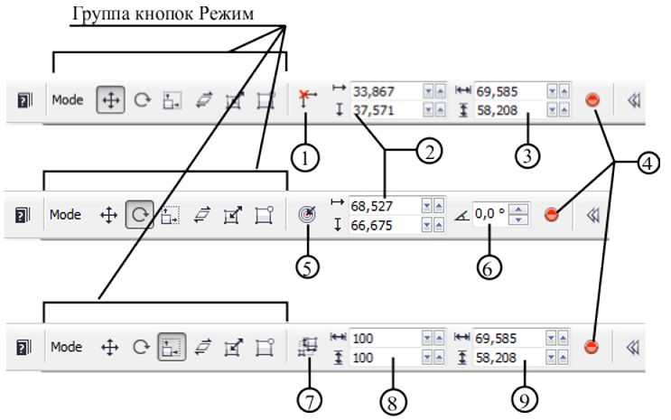

# Трансформация объектов в Corel PHOTO-PAINT

Можно изменять размер и масштаб объектов, поворачивать их, наклонять, искажать, отражать и подвергать перспективному преобразованию. Большую часть трансформаций можно выполнить, используя различные режимы Панели свойств, связанные с инструментом **Object Pick** (Указатель объектов). Для применения искажений и эффекта перспективы нельзя использовать Панель свойств, эти трансформации выполняются непосредственно с использованием манипуляторов, которые появляются вокруг выделяющей рамки после выбора объекта.

В окне изображения можно также производить другие трансформации непосредственно при помощи манипуляторов выделяющей рамки. Во всех режимах редактирования объектов можно трансформировать один объект, несколько выделенных объектов или группу объектов целиком.

### Инструмент Object Pick (Указатель объектов)

Практически все манипуляции с объектом и его трансформация производятся с помощью инструмента **Object Pick** (Указатель объектов). Этот инструмент самый первый на панели **Toolbox** (Набор инструментов). Быстрая клавиша этого инструмента – **О**. Инструмент **Object Pick** (Указатель объектов) имеет на Панели свойств определенный набор элементов управления для каждого из режимов трансформации (рис. 1). Как показано на рис. 1, Панель свойств инструмента во всех режимах имеет неизменную группу кнопок – **Mode** (Режим). В этой группе находятся следующие кнопки:

*   Кнопка **Position and size** (Положение и размеры) – переключает инструмент указанный режим. В этом режиме можно задать положение и размеры объекта.
*   Кнопка **Rotate** (Поворот) – переключает инструмент указанный режим. В этом режиме можно задать позицию центра вращения и угол поворота.
*   Кнопка **Scale** (Масштаб) – переключает инструмент указанный режим. В этом режиме можно задать размеры и масштаб объекта.
*   Кнопка **Skew** (Наклон) – переключает инструмент указанный режим. В этом режиме можно задать только положение объекта.
*   Кнопка **Distort** (Искажение) – переключает инструмент указанный режим. В этом режиме на Панели свойств нет дополнительных элементов управления.
*   Кнопка **Perspective** (Перспектива) – переключает инструмент указанный режим. В этом режиме на Панели свойств нет дополнительных элементов управления.

На рис. 1 показана Панель свойств инструмента **Object Pick** (Указатель объектов) в различных режимах (сверху вниз): в режиме **Position and size** (Положение и размеры); в режиме **Rotate** (Поворот) и режиме **Scale** (Масштаб).

Перечислим теперь остальные элементы управления на Панели свойств. Обратите внимание, что на рис. 1 идет сквозная нумерация элементов управления для всех режимов.

1\. Кнопка **Relative position** (Относительное положение) – позволяет задавать расположение объекта относительно начала координат или относительно текущего положения. При включении режима **Relative position** (Относительное положение) в группе счетчиков **Position** (Расположить) устанавливается значение равное 0.  
2\. Группа счетчиков **Position** (Расположить) – указывает и позволяет задать координаты объекта (верхней левой точки ограничивающей рамки). Эта группа счетчиков присутствует на Панели свойств в режиме **Position and size** (Положение и размеры) и **Rotate** (Поворот).  
3\. Группа счетчиков **Scale** (Масштаб) – позволяет задать размер объекта.  
4\. Кнопка **Apply transformation** (Применение преобразования) – отображается на Панели свойств во всех режимах и позволяет применить изменения заданные с помощью других элементов управления.  
5\. Кнопка **Relative center** (Относительно центра) – находится на Панели свойств в режиме Поворота. Позволяет задать координаты центра вращения объекта относительно начала координат линеек или относительно его текущего положения. При включении режима **Relative center** (Относительно центра) в группе счетчиков **Position** (Расположить) устанавливается значение равное 0.  
6\. Счетчик **Rotation angle** (Угол поворота) – позволяет задать угол поворота объекта.  
7\. Кнопка **Maintain ratio** (Сохранять соотношение сторон) – находится на Панели свойств в режиме **Scale** (Масштаб). Позволяет сохранять пропорции при изменении размеров объекта.  
8\. Группа счетчиков **Scale** (Масштаб) – позволяет изменять размеры объекта в процентах от его текущего размера.  
9\. Группа счетчиков **Size** (Размер) – позволяет задать ширину и высоту объекта.

Переключение между режимами трансформации можно выполнять не только с помощью Панели свойств, но и с помощью мыши. Для отображения стрелок, указывающих направление вращения и наклон, а также круглого значка, который можно перемещать, изменяя тем самым центр вращения объекта, дважды щелкните мышью внутри выделяющей рамки. Для отображения манипуляторов, применяемых для внесения искажения или придания перспективы, щелкните мышью соответственно третий и четвертый раз. Я могу с уверенностью сказать, что вы 90% работы по трансформации объектов будете выполнять мышью, а не с помощью элементов на Панели свойств.