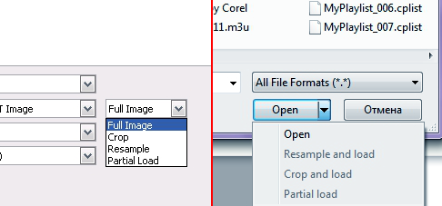
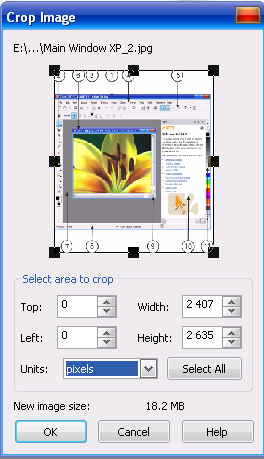
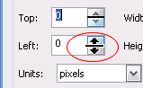
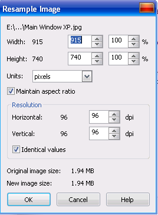
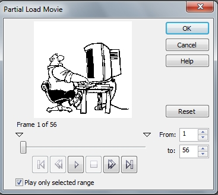
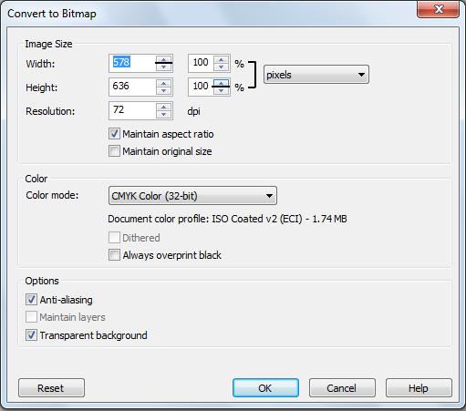

# Варианты открытия изображений в PHOTO-PAINT

Итак рассмотрим варианты открытия изображений, которые нам предоставляет Corel PHOTO-PAINT. Стоит отметить, что окно открытия изображения в Windows XP несколько отличается от более новых версий этой операционной системы.

### Open (Открыть) / Full Image (Целиком)

Этот вариант открытия изображения установлен по умолчанию. При его выборе, изображение целиком откроется в своем собственном окне, где вы можете сразу начать над ним работу.

### Crop and load (Обрезать и загрузить) / Crop (Обрезка)

При выборе этого способа открытия изображения, появится диалоговое окно **Crop Image** (Обрезка изображения). С помощью этого способа вы можете выполнить обрезку, загрузив только необходимую для работы часть рисунка. Этот вариант открытия полезен в том случае, когда вы собираетесь открыть большое по размеру изображение и заранее знаете, что вам для выполнения работы понадобится определенный фрагмент (часть), а не изображение целиком.

Рассмотрим подробнее элементы диалогового **окна Crop Image** (Обрезка изображения).  

Основную часть окна занимает область просмотра, окруженная рамкой с маркерами по периметру. Затем расположена область **Select area to crop** (Область обрезки), в которой находятся четыре поля: **Top** (Сверху); **Left** (Слева); **Width** (Ширина); **Hight** (Высота), а так же раскрывающийся список **Units** (Единицы измерения) и кнопка **Select All** (Выбрать все). Ниже расположено поле **New image size** (Новые размеры). Обрезку изображения можно сделать с помощью мыши, перетащив один из маркеров рамки в области просмотра или введя с клавиатуры требуемые значения в соответствующие поля. Кроме задания размеров рамки обрезки, вы можете интерактивно выбрать ее позицию. Для этого наведите мышь на область просмотра. Указатель мыши примет вид руки. Теперь вы можете мышью перетащить область обрезки на нужную позицию. Значения в полях ввода так же можно установить с помощью мыши. При этом можно установить значение не только щелкая на кнопках в виде двух треугольников, но и наведя мышь между этими кнопками, в этом случае указатель примет вид двунаправленной стрелки.

Перемещение мыши вверх, при нажатой левой кнопке, увеличивает значения, перемещение мыши вниз — уменьшает значение. _Возможность такого способа установки значений с помощью мыши, характерна для приложений CorelDRAW Graphics Suite._ Поля Top (Сверху) и Left (Слева), предназначены для задания смещения рамки обрезки, а Width (Ширина) и Hight (Высота) — размеры этой рамки.

Раскрывающийся список **Units** (Единицы измерения) предоставляет вам выбор единиц измерения изображения. Однако выбор в этом списке, влияет только на отображаемые в этом окне значения. Например, если вы выберите пиксели, обрежете изображение и откроете его, то в окне документа, единицы измерения всё равно будут указаны в миллиметрах. Выбор же единиц измерения для работы с самим документом делается в диалоговом окне **Options** (Параметры).

_Работа по настройке параметров PHOTO-PAINT будет рассмотрена дальше в этой книге._

Строка **New image size** (Новые размеры) показывает новый размер файла после обрезки. И наконец, кнопка **Select All** (Выбрать все), щелчок на ней снова выделит все изображение. После того, как вы определились с размером обрезаемой области, щелкните ОК. Обрезанная часть изображения откроется в окне документа с названием Untitled (Безымянный).

### Resample and load (Изменить разрешение) / Resample (Изменить разрешение)

При выборе этого варианта, откроется диалоговое окно **Resample Image** (Изменение разрешения изображения).

Здесь вы можете изменить разрешение изображения и его размер до загрузки в редактор PHOTO-PAINT. Строка в верхней части окна показывает имя файла и путь к нему. Ниже располагается группа из четырех полей ввода. **Width** (Ширина) и **Height** (Высота) показывают размер изображения в единицах, выбранных в раскрывающемся списке **Units** (Единицы измерения). В этих полях можно указать новый размер изображения или изменить степень уменьшения в процентах с помощью полей справа, показывающих размер в процентах.

Флажок **Maintain aspect ratio** (Сохранять пропорции) позволяет пропорционально изменять размеры изображения.

В области **Resolution** (Разрешение), можно изменять разрешение изображения отдельно по горизонтали в поле Horizontal (По горизонтали) и по вертикали, в поле Vertical (По вертикали). Если установить флажок **Identical values** (Одинаковые значения), то значения разрешения по высоте и ширине будут совпадать. В нижней части диалогового окна Resample Image (Изменение разрешения изображения) размещается информация о первоначальном размере файла и о размере после изменения.

### Partial load (Часть)

Этот вариант загрузки становится доступным, если вы открываете файл анимации, например, в формате **gif**. Если выбрать этот вариант, откроется диалоговое окно **Partial Load Movie** (Частичная загрузка фильма), позволяющее открыть в качестве нового документа некоторые из кадров.

В области просмотра, при открытии окна представлено уменьшенное изображение первого кадра. Перемещая ползунок, вы просматриваете все кадры анимации. Внизу размещаются элементы, похожие на кнопки управления плейером. Они и действуют аналогичным образом. Нажав на треугольник, вы даете команду воспроизведения анимации. Кнопка с квадратом останавливает воспроизведение. Кнопки в виде спаренных треугольников позволяют переместиться на один кадр, вперед или назад. Кнопки с сочетаниями треугольника и черты позволяют сразу перейти к первому или последнему кадру. Для выбора диапазона кадров предназначены поля **From** (От) и **То** (До). Если установить флажок **Play only selected range** (Воспроизводить только выбранный диапазон), то при воспроизведении будут демонстрироваться только кадры выбранного диапазона. Кнопка **Reset** (Восстановить) приводит параметры в окне к первоначальному состоянию. Определившись с требуемым диапазоном, щелкните на кнопке ОК, в результате чего будет создан новый файл содержащий только выбранные кадры.

### Открытие векторных рисунков

Честно говоря, я сомневаюсь, что вы будете часто пользоваться этой возможностью, а может не будете пользоваться вовсе, однако PHOTO-PAINT предоставляет вам возможность открыть векторный рисунок, например, созданный в CorelDRAW. При открытии такого файла, PHOTO-PAINT сначала предложит вам преобразовать его в растровое изображение. После нажатия кнопки Open (Открыть), в диалоговом окне Open an Image (Открытие изображения), появится диалоговое окно **Convert to Bitmap** (Преобразование в растровое изображение).

В этом окне можно задать параметры преобразования. В области **Image size** (Размер изображения) можно указать размеры и разрешение растрового изображения, которое будет создано на основе векторного рисунка. Флажки **Maintain aspect ratio** (Сохранять пропорции) и **Maintain original size** (Сохранять размер файла) позволяет сохранить пропорции открываемого рисунка и размер. При установке флажка Maintain original size (Сохранять размер файла), поля Width (Ширина) и Height (Высота), становятся неактивными. В этой же области можно указать и единицы измерения.

В области **Color** (Цвет) отображается информация о цветовом профиле документа, а также можно выбрать цветовой режим в списке **Color mode** (Цветовой режим). В группе **Options** (Параметры) можно задать прозрачность фона и сглаживание.