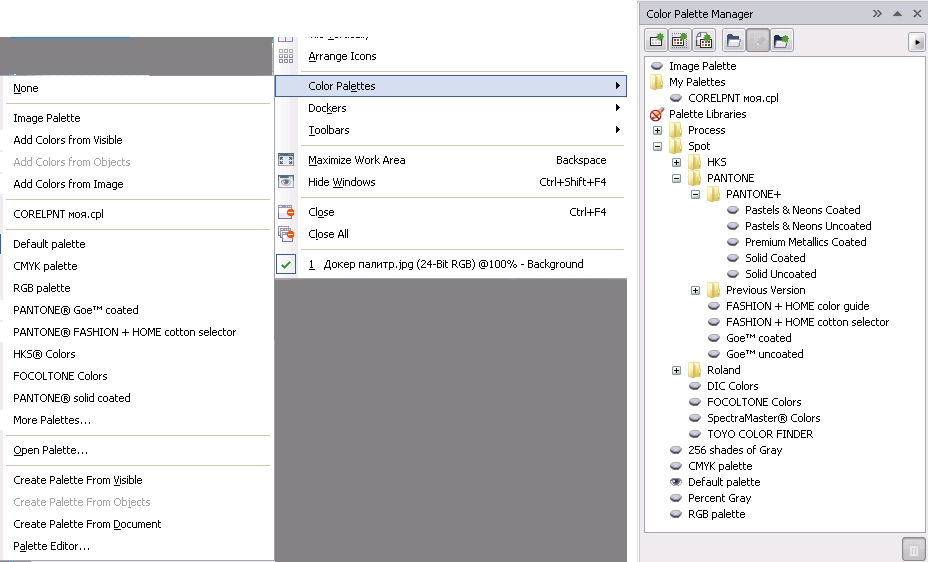

# Выбор экранных цветовых палитр в Photo-Paint

Помимо экранной цветовой палитры по умолчанию, Photo-Paint позволяет вам выбрать другую палитру. Набор палитр входящих в состав Photo-Paint способен удовлетворить практически любые ваши потребности в выборе цвета. Доступ к цветовым палитрам можно получить с помощью команды **Window > Color Palettes** (Окно > Цветовые палитры). В подменю **Color Palettes** (Цветовые палитры) имеется доступ к палитрам, с которыми по мнению разработчиков, приходится работать чаще всего (рисунок слева). Если предлагаемый перечень палитр вас не устраивает, вы можете открыть другие дополнительные палитры. Для этого выполните команду **Window > Color Palettes > More Palettes** (Окно > Цветовые палитры > Дополнительные палитры). Открывшийся докер **Color Palette Manager** (Средство просмотра цветовых палитр) дает вам доступ ко всем палитрам входящим в состав Corel Photo-Paint X5.

Почти все кнопки в верхней части докера служат для выполнения тех же команд, которые находятся или в меню палитры или в подменю **Color Palettes** (Цветовые палитры). Кнопка в нижней части докера **Delete selected items** (Удалить выбранные элементы) становится активной только при выборе пользовательской палитры. Удалить одну из палитр поставляемых в комплекте с Photo-Paint с помощью этой кнопки не удастся. Чтобы вызвать нужную вам палитру на экран, достаточно щелкнуть возле названия палитры на значке в виде глаза.

При работе с палитрами, возможно у вас вызовет интерес набор палитр находящийся в папке **Process**. В этой папке имеется две вложенных папки: **CMYK** и **RGB**, в которых находятся палитры цветов для применения в различного вида работах. Например, в папке **RGB/People** находятся палитры с цветами характерными для человека, цветами глаз, волос и т. д.

Если вам в данный момент при работе экранная палитра не нужна или вы хотите высвободить для работы еще хоть немного пространства, вы можете закрыть экранную палитру, выбрав в меню **Window** (Окно) команду **Color Palettes > None** (Цветовые палитры > Нет). С помощью команды **Window > Color Palettes > Open Palette** (Окно > Цветовые палитры > Открыть палитру) вы можете открыть в окне **Open Palette** (Открыть палитру ) созданную вами палитру аналогично тому, как было описано выше.