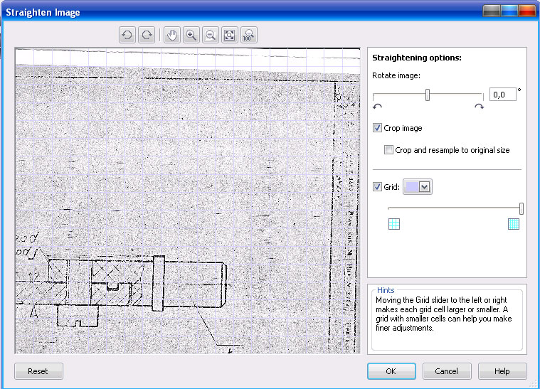
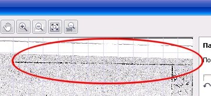

# Выравнивание изображения в PHOTO-PAINT

По сравнению с поворотом изображения, рассмотренным в одной из предыдущих тем, в **Corel PHOTO-PAINT Х5** есть более удобное, на мой взгляд, средство для поворота изображения, которое вам наверняка понравится больше. Этот инструмент идеально подходит для **выравнивания неровно сканированных изображений**. После открытия такого изображения, вам необходимо выполнить команду **Adjust > Straighten Image** (Настройка > Выпрямить изображение). Появится одноименное диалоговое окно Straighten Image (Выпрямить изображение).

В области просмотра окна, которая занимает его основную часть, вы увидите изображение на фоне сетки. Эта сетка служит для визуальной оценки степени смещения изображения по вертикали и горизонтали. Это удобно, т.к. позволяет вам визуально определять и контролировать угол, на который необходимо повернуть изображение, чтобы его выровнять.

В верхней части окна находится небольшая панель инструментов для масштабирования изображения и навигации в области просмотра. В правой части окна находятся элементы управления, с помощью которых, собственно и производится выравнивание. Ниже этих элементов управления находится область **Hints** (Советы). В этой области появляются подсказки с достаточно подробным описанием назначения того или иного элемента управления диалогового окна **Straighten Image** (Выпрямить изображение). Если вы изменили (уменьшили) размер диалогового окна, в области **Hints** (Советы) может не вместиться весь текст подсказки. В этом случае в нижнем правом углу появляется ссылка выделенная синим цветом — **More** (Больше). Щелкнув на ней, вы увидите весь текст подсказки.

Рассмотрим более подробно элементы этого окна. Кнопки на верхней панели инструментов (слева направо):

*   Поворот изображения на 90° против часовой стрелки;
*   Поворот изображения на 90° по часовой стрелке;
*   Панорама. Этот инструмент аналогичен инструменту Pan (Панорама) рассмотренному в одной из предыдущих тем;
*   Крупнее. Кнопка для увеличения масштаба изображения в области просмотра;
*   Мельче. Кнопка для уменьшения масштаба изображения в области просмотра;
*   Отображение изображения в соответствии с размером окна. Эта кнопка масштабирует изображение таким образом, чтобы оно целиком было видно в области просмотра.
*   Отображение изображения обычного размера. Эта кнопка восстанавливает размер изображения. Если открытое вам изображение большое, вы будите видеть в области просмотра только его часть, т. к. нормальный размер изображение больше области просмотра в диалоговом окне Straighten Image (Выпрямить изображение).

В правой части окна находится область **Straightening options** (Параметры выпрямления). Именно в этой области вам и предстоит основная работа по выпрямлению изображения. В общем случае, ваше изображение вряд ли идеально разместится в области просмотра. Поэтому выравнивание следует начинать с подбора масштаба и размеров сетки.

Как только диалоговое окно откроется, указатель мыши примет вид руки, т. е. активным будет **инструмент Pan** (Панорама). В этом случае, для увеличения масштаба достаточно щелкнуть левой кнопкой мыши в области просмотра. Для уменьшения масштаба — щелкните правой кнопкой мыши. Для перетаскивания изображения в области просмотра, просто перетащите его, удерживая нажатой левую кнопку мыши. Ваша задача, разместить изображение так, чтобы одна из его сторон совпала с линией сетки. Конечно, т.к. изображение имеет перекос, то стороны изображения не будут параллельны линиям сетки, но часть границы изображения возможно совпадет с горизонтальной или вертикальной линией сетки. Вам нужно постараться найти какой-либо ориентир, по которому вам будет легче определиться с выравниванием.

На изображении выше показан фрагмент сканированного листа чертежа. Для того, чтобы лучше был виден перекос листа, я увеличил масштаб и обвел овалом его угол, где перекос заметен лучше всего. Здесь ориентиром могут служить не только границы листа, но и осевые линии на чертеже или линии штампа. Ведь вам заведомо известно, что осевая линия должна быть расположена горизонтально. Теперь остается подобрать масштаб и выровнять изображение, чтобы осевая линия совпала с горизонтальной линией сетки. Иногда такого совмещения добиться невозможно при настройках имеющихся по умолчанию.

Когда вы подберете более или менее точно масштаб, наступит очередь подгонять сетку для удобства выравнивания. Размеры ячеек сетки задаются с помощью ползунка **Grid** (Сетка). Перемещение ползунка вправо уменьшает размеры ячеек, влево — увеличивает. В этой же области можно задать цвет сетки, воспользовавшись раскрывающимся списком. Это полезно, когда цвет сетки по умолчанию, сливается с изображением. Вы можете выбрать цвет контрастирующий с изображением. Пипетка находящаяся в раскрывающемся списке, позволяет задать цвет сетки, взяв пробу из изображения. Если вам по какой-либо причине сетка не нужна, сбросьте флажок **Grid** (Сетка).

После выполнения всех предварительных манипуляций, можно приступить к выравниванию. Для этого служит ползунок **Rotate Image** (Поворот изображения). Вы можете повернуть изображение по часовой стрелке, перемещая ползунок вправо или против часовой стрелки — перемещая ползунок влево. В поле, справа от ползунка отображается текущий угол поворота в градусах. Мы можете его задать прямо в этом поле, введя значение. После ввода значения угла поворота, нажмите клавишу **Enter**, чтобы просмотреть результат действия. Для возврата к исходному состоянию, нажмите кнопку **Reset** (Сброс), в нижней части окна.

В области **Rotate Image** (Поворот изображения) имеется еще два флажка: **Crop image** (Обрезка изображения) и **Crop and resample to original size** (Обрезка и изменение разрешения до исходного размера). При установке первого флажка, изображение после выравнивания обрезается (обрезаемая часть затемняется в области просмотра) и его размер становится меньше, но сохраняются пропорции. При установке обеих флажков, изображение обрезается, но оставшаяся после обрезки часть увеличивается в размерах, до размеров исходного изображения. Если оба флажка сбросить, то изображение просто будет повернуто, но не обрезано. В этом случае пустые области по границам изображения будут заменены цветом фона.