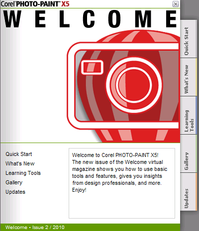

# Запуск Corel PHOTO-PAINT (окно приветствия)

После запуска PHOTO-PAINT, перед вами окажется главное окно программы с диалоговым окном «Приветствия».

Несмотря на то, что назначение данного окна вполне очевидно, давайте подробнее рассмотрим его возможности, тем более, что многие пользователи найдут весьма полезным, начинать работу с программой именно с него. Следует однако оговориться, что если вы уже работали перед этим с CorelDRAW, то работа с окном приветствия вам уже знакома. Эти окна практически идентичны в обеих приложениях (имеется ввиду принцип их «устройства» и работы). В этом случае вы можете пропустить описание данного окна. Для тех пользователей, которые решили начать осваивать пакет CorelDRAW Graphics Suite X5 именно с PHOTO-PAINT, имеет смысл ознакомиться с основными командами окна приветствия.

В нижней левой части окна приветствия имеется список команд:

*   **Quick Start** (Быстрый запуск);
*   **What’s New** (Новые возможности);
*   **Learning Tools** (Средства обучения);
*   **Gallery** (Галерея);
*   **Updates** (Обновления)

Если вы обратили внимание, то сбоку, с правой части окна приветствия имеется набор вкладок имеющих то же название. При наведении курсора мыши на любую из этих строк, в прямоугольной рамке, справа от упомянутого списка команд, появится краткое описание назначения соответствующей вкладки. Давайте кратко ознакомимся с каждой из этих вкладок.

*   Вкладка Quick Start (Быстрый запуск) предназначена для работы с файлами (изображениями): созданием, открытием существующего или получением из внешнего источника, например, сканера.
*   Вкладка What’s New (Новые возможности). Название говорит само за себя. На этой вкладке представлены те нововведения и изменения, которые были добавлены в PHOTO-PAINT Х5 по сравнению с предыдущими версиями.
*   Вкладка Learning Tools (Средства обучения). На этой вкладке перечислены обучающие материалы и их краткое описание, в то числе и материалы находящиеся на DVD-диске с программой.
*   Вкладка Gallery (Галерея). На этой вкладке имеются примеры работ созданных с помощью CorelDRAW Graphics Suite X5.
*   И наконец, последняя вкладка – вкладка Updates (Обновления). На этой вкладке имеется ссылка для перехода на Web-ресурс для проверки наличия обновлений.

Вы можете в любой момент придать окну приветствия первоначальный вид. Для этого достаточно щелкнуть на слове **Welcome** (Приветствие), в левом верхнем углу окна приветствия.

Так как, скорее всего, вы не будете слишком часто заглядывать на содержимое этих вкладок, за исключением **Quick Start** (Быстрый запуск), то остановимся на описании именно этой вкладки.

Итак, структура вкладки **Quick Start** (Быстрый запуск) внешне чем-то напоминает структуру таблицы. В верхнем левом углу находится собственно само название вкладки – Quick Start (Быстрый запуск). Ниже названия расположены заголовки областей вкладки: **Welcome/ Quick Start** (Приветствие/ Быстрый запуск); **Open Recent** (Открыть последний) и **Start New** (Начать новый). Левая часть вкладки разделена на две расположенных друг под другом области: **Preview of the most recently used documents** (Просмотр недавно использованных документов) и **Document information** (Сведения о документе).

Область **Open Recent** (Открыть последний) содержит список последних использованных документов. В отличие от более ранних версий, список может вместить довольно большое количество документов, что естественно лучше и удобней, чем лишний раз пользоваться открытием документа. При наведении указателя мыши на название документа, в области просмотра **Preview of the most recently used documents** (Просмотр недавно использованных документов) появляется уменьшенная копия изображения. А в области **Document information** (Сведения о документе), краткая информация о файле изображения: путь к папке с файлом, дата создания, имя файла и размер. Ниже списка файлов расположена кнопка **Open other…** (Открыть другой…). Эта кнопка предназначена для открытия изображения сохраненного на диске, в том случае, если это изображения отсутствует в списке недавно использовавшихся документов. После нажатия этой кнопки, открывается диалоговое окно Open an Image (Открытие изображения).

Область **Start New** (Начать новый) содержит команды: **New blank document** (Новый пустой документ); **New from Clipboard** (Создать из буфера); **Acquire an image** (Запрос изображения). Первая из перечисленных команд служит для создания нового документа, вторая позволяет создать изображение из данных содержащихся в буфере обмена. Это весьма полезная команда, дающая возможность создать файл изображения из буфера обмена, например, при создании скриншота экрана и дальнейшей его обработки. Команда Acquire an image (Запрос изображения) служит для получения изображений со сканера. Под названием каждой команды есть краткое описание назначения данной команды.

И наконец, в нижней части вкладки **Quick Start** (Быстрый запуск) имеется два флажка: **Make this the default Welcome screen page** (Использовать этот экран приветствия по умолчанию) и **Always show the Welcome screen at launch** (Всегда отображать экран приветствия при запуске). Первый флажок отвечает за то, на какой из вкладок будет открываться окно приветствия. Если вы, например, установите этот флажок на вкладке Gallery (Галерея), то при запуске PHOTO-PAINT окно приветствия откроется именно на этой вкладке. Флажок Always show the Welcome screen at launch (Всегда отображать экран приветствия при запуске) отвечает за то, будет ли при запуске PHOTO-PAINT появляться экран приветствия или нет. Если сбросить этот флажок, то экран приветствия при запуске программы, появляться не будет.

Экран приветствия можно вызвать в любой момент во время сеанса работы, нажав одноименную кнопку на Стандартной панели инструментов.

_В новой версии CorelDRAW Graphics Suite появилось, приятное на мой взгляд, новшество — всплывающая подсказка, которая не просто показывает название кнопки или инструмента, но и содержит краткое описание назначения данного элемента._

В отсутствие открытых документов в главном окне располагаются лишь основные элементы. Для того чтобы осмотреть элементы управления, достаточно открыть любое растровое изображение или создать новый файл с настройками по умолчанию.